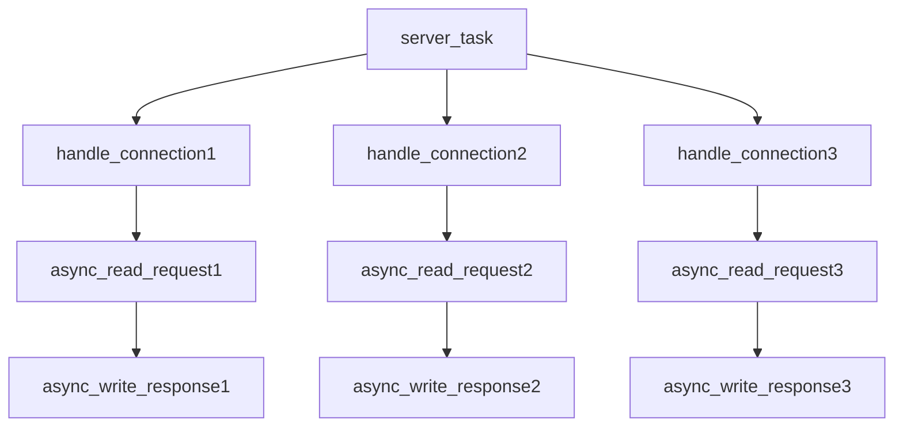

# Coflux: Coroutines Conflux

[](https://isocpp.org/)
[](https://opensource.org/licenses/MIT)


​


*一个用于构建静态定义、高性能并发系统的C++20协程框架*
<br>
*A C++20 coroutine framework for building statically-defined, high-performance concurrent systems*

[中文版本](./docs/README.zh.md) 

## Introduction

Coflux is a modern concurrency framework built on C++20 Coroutines.

Coflux is designed with the **Structured Concurrency** `task/fork` model and the "**Task-as-Context**" heterogeneous computing concept, aiming to statically describe a safe and predictable concurrent system at compile time.

**Structured Concurrency** and **Task-as-Context** jointly articulate the core philosophy: the "**Static Channel**." This ensures that once all asynchronous work is initiated, it executes smoothly along a predetermined path, much like water flow in a channel.

## Core Features

- **Structured Concurrency**: A generalized RAII-style lifecycle management. Each `task` derives child `fork`s via the `environment protocol`, syntactically eliminating "orphan tasks."
- **Task-as-Context**: There is no external `context`. Each `task` itself is a complete, isolated execution environment that supports the operation of all `fork`s.
- **Heterogeneous Execution**: The `scheduler` is designed as a template-based `executor` cluster, enabling tasks within the same concurrent scope to run in different execution contexts, achieving high decoupling from lifecycle management.
- **PMR Memory Model**: Integration with `std::pmr` via the `environment protocol` allows users to inject custom, high-performance memory allocation strategies for different concurrent scopes at runtime.
- **Modern C++ Design**: Utilizing modern C++ language features and advanced design, we strive for the elegance of "conciseness and profound meaning" (Micro-Statement, Grand-Meaning) in the source code.

## Core Philosophy

Coflux's design is driven by several core concepts.
* **Structured Concurrency** based on the `task/fork` model, eliminating orphan tasks and memory leaks.
* **PMR support** and **Heterogeneous Execution support** based on **Task-as-Context**.
* **Static Channel** philosophy: pursuing *zero-cost abstraction* to describe an asynchronous concurrent system to the maximum extent at compile time.

To delve deeper into **Structured Concurrency**, **Task-as-Context**, and the introduction of the **Static Channel**, please refer to the **[Design and Architecture Document (ARCHITECTURE.md)](./docs/ARCHITECTURE.en.md)**.

## Performance: Near-Zero Cost

Coflux is designed for peak performance, targeting systems that must minimize the overhead of creating, scheduling, and managing asynchronous tasks. Our **Task-as-Context** model and deep **PMR (Polymorphic Memory Resource) integration** are key enabling mechanisms.

Micro-benchmarks conducted on an **AMD Ryzen 9 7940H (8 Cores/16 Threads, 5.2GHz)** using a `noop_executor` demonstrate Coflux's capabilities:

* 🚀 **Theoretical Peak (Monotonic Allocator):** Over **14 million** `fork` creation-execution-destruction cycles per second, with core framework overhead **less than 70 nanoseconds** per `fork`. This showcases the raw potential when memory allocation cost is nearly zero.
* ⚙️ **Practical Throughput (Pool Allocator):** Sustained throughput of nearly **4 million** complete creation-**destruction** cycles per second (including returning memory to the memory pool). This highlights its excellent performance (approx. 250 nanoseconds per round trip) and cache efficiency in scenarios requiring memory reuse.

These results confirm that the overhead introduced by Coflux is negligible, quickly reaching hardware bottlenecks (CPU Cache). It provides a robust, high-performance foundation for demanding concurrent applications.

For detailed methodology, hardware specifications, and full data analysis, please refer to **[BENCHMARK.md](./docs/BENCHMARK.en.md)**.

## Getting Started

### 1. Structured Concurrency
   
The example below demonstrates defining a root task (`server_task`) that runs on the main thread (`noop_executor`), which then derives three child task chains running on a thread pool (`thread_pool_executor`).

Since `noop` does nothing, the `task` coroutine frame will resume on the `thread_pool_executor` until `co_return`. However, the main thread's RAII will block until all tasks are complete.

```C++
#include <iostream>
#include <string>
#include <coflux/scheduler.hpp>
#include <coflux/combiner.hpp>
#include <coflux/task.hpp>

using pool = coflux::thread_pool_executor<>;
using timer = coflux::timer_executor;
using sche = coflux::scheduler<pool, timer>;

// Simulate asynchronous reading of a network request
coflux::fork<std::string, pool> async_read_request(auto&&, int client_id) {
    std::cout << "[Client " << client_id << "] Waiting for request..." << std::endl;
    co_await std::chrono::milliseconds(200 + client_id * 100);
    co_return "Hello from client " + std::to_string(client_id);
}

// Simulate asynchronous writing back of a network response
coflux::fork<void, pool> async_write_response(auto&&, const std::string& response) {
    std::cout << "  -> Echoing back: '" << response << "'" << std::endl;
    co_await std::chrono::milliseconds((rand() % 5) * 100);
    co_return;
}

// Handle a single connection using structured concurrency
coflux::fork<void, pool> handle_connection(auto&&, int client_id) {
    try {
        auto&& env = co_await coflux::context();
        auto request = co_await async_read_request(env, client_id);
        auto processed_response = request + " [processed by server]";
        co_await async_write_response(env, processed_response);
        std::cout << "[Client " << client_id << "] Connection handled successfully." << std::endl;
    }
    catch (const std::exception& e) {
        std::cerr << "[Client " << client_id << "] Error: " << e.what() << std::endl;
    }
    // When handle_connection finishes, all forks it created (read/write) are automatically cleaned up
}

int main() {
    std::cout << "--- Demo: Structured Concurrency with when_all ---\n";
    {
        auto env = coflux::make_environment<sche>(pool{ 4 }, timer{});
        auto server_task = [](auto env) -> coflux::task<void, pool, sche> {
            std::cout << "Server task starting 3 concurrent connections...\n";
            co_await coflux::when_all(
                handle_connection(co_await coflux::context(), 1),
                handle_connection(co_await coflux::context(), 2),
                handle_connection(co_await coflux::context(), 3)
            );
            std::cout << "All connections handled.\n";
            }(env);
        // When server_task destructs, RAII automatically blocks the main thread
        // until server_task and all its child forks (handle_connection) are complete.
    }
    std::cout << "\n--- Demo Finished ---\n";
    return 0;
}
```



### 2\. Mixed Style: `co_await` and `on_xxx` Chaining

The example below demonstrates asynchronous code using both coroutine style and callback style.
Code in the form `auto res = co_await std::move(t).on_xxx().on_xxx()` describes a "just-in-time configuration" fast path.
Coflux guarantees that `co_await` is implemented non-blockingly after all `on_xxx` calls, which aligns with the value semantics model: the value received by `on_value` is obtained from an internal lvalue copy, while `res` will be assigned the rvalue result of `t`.

To simulate exceptions in synchronous scenarios, Coflux guarantees that a specific exception can only be caught across threads or consumed once by `on_error`. After this, repeated calls to `get_result` will throw `std::runtime_error("Can't get result because there is an exception.")`.

```c++
#include <iostream>
#include <string>
#include <coflux/scheduler.hpp>
#include <coflux/task.hpp>

using pool = coflux::thread_pool_executor<>;
using timer = coflux::timer_executor;
using sche = coflux::scheduler<pool, timer>;

// Helper function: Simulate async IO
coflux::fork<std::string, pool> async_fetch_data(auto&&, std::string data, std::chrono::milliseconds delay) {
    co_await delay;
    co_return "Fetched$" + data;
}

// Helper function: Simulate async IO (will fail)
coflux::fork<std::string, pool> async_fetch_data_error(auto&&) {
    co_await std::chrono::milliseconds(50);
    throw std::runtime_error("Data fetch failed!");
    co_return "";
}

int main() {
    std::cout << "--- Demo: Mixed Style (co_await + Chaining) ---\n";
    {
        auto env = coflux::make_environment<sche>(pool{ 2 }, timer{});
        auto launch = [&](auto env) -> coflux::task<void, pool, sche> {
            auto ctx = co_await coflux::context();
            std::atomic<bool> success_called = false;
            std::atomic<bool> error_called = false;

            // Demonstrate success path
            std::cout << "Awaiting success task with .on_value()...\n";
            std::string result = co_await async_fetch_data(ctx, "SuccessData", std::chrono::milliseconds(50))
                .on_value([&](const std::string& s) {
                std::cout << "  [on_value callback] Fired for: " << s << "\n";
                success_called = true;
                    })
                .on_error([&](auto) { // Will not execute
                });
            std::cout << "  [co_await result] Got: " << result << "\n";

            // Demonstrate failure path
            std::cout << "Awaiting error task with .on_error()...\n";
            try {
                // co_await an rvalue task
                co_await async_fetch_data_error(ctx)
                    .on_value([&](auto) { // Will not execute
                    })
                    .on_error([&](std::exception_ptr e) {
                    std::cout << "  [on_error callback] Fired! Exception consumed.\n";
                    error_called = true;
                        });
            }
            catch (const std::runtime_error& e) {
                // After the exception is handled by on_error, get_result() will throw No_result_error
                std::cout << "  [co_await catch] Correctly caught: " << e.what() << "\n";
            }

            assert(success_called.load());
            assert(error_called.load());
            };
        auto demo_task = launch(env);
        // RAII destruction will wait for demo_task to complete
    }

    std::cout << "\n--- Demo Finished ---\n";
    return 0;
}
```

### 3\. Synchronous Wrapper `make_fork` and `fork_view` for Building DAG Dependencies

The example below demonstrates packaging a synchronous task into a `fork` and specifying its `executor`.

`fork_view` can be passed within the scope of the same `task` to observe the result of a `fork`, meaning complex dependency graphs can be formed.

```c++
#include <iostream>
#include <string>
#include <coflux/scheduler.hpp>
#include <coflux/task.hpp>
#include <coflux/combiner.hpp>

using pool = coflux::thread_pool_executor<>;
using timer = coflux::timer_executor;
using sche = coflux::scheduler<pool, timer>;

int main() {
    std::cout << "--- Demo: `make_fork` and `fork_view` Dependency Graph ---\n";
    {
        auto env = coflux::make_environment<sche>(pool{ 3 }, timer{});

        // 1. Define synchronous/asynchronous callables
        // Wrap a "std::" function (or similar synchronous lambda)
        auto sync_fetch_user_id = [](const std::string& username) -> int {
            std::cout << "  [Task A] (Sync) Fetching ID for '" << username << "'\n";
            std::this_thread::sleep_for(std::chrono::milliseconds(10));
            return std::stoi(username.substr(username.find_first_of('$') + 1));
            };
        // B and C depend on the result of A
        auto fetch_user_name = [](auto&&, coflux::fork_view<int> id_view) -> coflux::fork<std::string, pool> {
            int id = co_await id_view;
            std::cout << "  [Task B] (Async) Getting name for ID " << id << "\n";
            co_return "Daking";
            };
        auto fetch_user_perms = [](auto&&, coflux::fork_view<int> id_view) -> coflux::fork<std::string, pool> {
            int id = co_await id_view;
            std::cout << "  [Task C] (Async) Getting perms for ID " << id << "\n";
            co_return "Admin";
            };

        auto launch = [&](auto env) -> coflux::task<void, pool, sche> {
            auto ctx = co_await coflux::context();

            // 2. Use make_fork to "fork-ify" the synchronous function
            auto get_id_fork_factory = coflux::make_fork<pool>(sync_fetch_user_id, ctx);

            // 3. Execution Graph
            auto id_task = get_id_fork_factory("daking$123");
            auto id_view = id_task.get_view(); // Share the result

            // 4. B and C launch concurrently
            auto name_task = fetch_user_name(ctx, id_view);
            auto perms_task = fetch_user_perms(ctx, id_view);

            // 5. Wait for the final result
            auto [name, perms] = co_await coflux::when_all(name_task, perms_task);
            std::cout << "  [Result] User: " << name << ", Permissions: " << perms << "\n";
            };
        auto demo_task = launch(env);
        // RAII destruction waits for completion
    }
    std::cout << "\n--- Demo Finished ---\n";
    return 0;
}
```

### 4\. `when(n)` Asynchronous Pipeline

The example below demonstrates how an asynchronous data flow can non-blockingly participate in a synchronous call chain via `co_await(vec | when(n))` (integrated with `ranges`).

`co_await` acts as a synchronization point, connecting the asynchronous environment with the synchronous environment by resolving asynchronous tasks into synchronous results.

```c++
#include <iostream>
#include <string>
#include <coflux/scheduler.hpp>
#include <coflux/combiner.hpp>
#include <coflux/task.hpp>

using pool = coflux::thread_pool_executor<>;
using timer = coflux::timer_executor;
using sche = coflux::scheduler<pool, timer>;

// Helper function: Simulate async IO
coflux::fork<std::string, pool> async_fetch_data(auto&&, std::string data, std::chrono::milliseconds delay) {
    co_await delay;
    co_return "Fetched$" + data;
}

int main() {
    std::cout << "--- Demo: Async Pipeline with `when(n)` ---\n";
    {
        auto env = coflux::make_environment<sche>(pool{ 5 }, timer{});

        auto launch = [&](auto env) -> coflux::task<void, pool, sche> {
            auto ctx = co_await coflux::context();
            std::vector<coflux::fork<std::string, pool>> downloads;

            // Start 5 downloads with different speeds
            downloads.push_back(async_fetch_data(ctx, "File 1 (200ms)", std::chrono::milliseconds(200)));
            downloads.push_back(async_fetch_data(ctx, "File 2 (50ms)", std::chrono::milliseconds(50)));
            downloads.push_back(async_fetch_data(ctx, "File 3 (300ms)", std::chrono::milliseconds(300)));
            downloads.push_back(async_fetch_data(ctx, "File 4 (10ms)", std::chrono::milliseconds(10)));
            downloads.push_back(async_fetch_data(ctx, "File 5 (70ms)", std::chrono::milliseconds(70)));

            std::cout << "Starting 5 downloads, waiting for the first 3 to complete...\n";

            // `co_await(vec | when(n))`
            // Wait for the 3 *fastest* tasks out of 5 to complete, and process to remove the "Fetched$" prefix
            std::cout << "\n  [Result] The first 3 completed files were:\n";
            for (const auto& s : co_await(downloads | coflux::when(3)) |
                std::views::transform([](auto&& s) { return s.substr(s.find_first_of('$') + 1); }))
            {
                std::cout << "  -> " << s << "\n";
            }
            };
        auto demo_task = launch(env);
        // RAII destruction waits for all tasks (including those not co_await-ed) to complete
    }
    std::cout << "--- Demo Finished ---\n";
    return 0;
}
```

### 5\. Generator Loops and Recursion

The example below demonstrates the two generation strategies supported by `coflux::generator`: looping and recursion.
`coflux::generator` mimics `input_range` and can be integrated into `std::ranges`.

Coflux supports recursive calls between different generators as long as the return types are the same.

```c++
#include <iostream>
#include <string>
#include <ranges>
#include <coflux/generator.hpp>

// === Generator Example ===
coflux::generator<int> fibonacci(int n) {
    int a = 0, b = 1;
    for (int i = 0; i < n; ++i) {
        co_yield a;
        int next = a + b;
        a = b;
        b = next;
    }
}

coflux::generator<int> recursive_countdown(int n, auto&& fibonacci) {
    if (n > 0) {
        co_yield fibonacci(n);
        co_yield recursive_countdown(n - 1, fibonacci);
    }
};

int main() {
    std::cout << "--- Demo: Generators (Loop & Recursion) ---\n";
    {
        // Looping
        std::cout << "Looping (Fibonacci):\n  ";
        auto view = fibonacci(15)
            | std::views::filter([](int n) { return n % 2 == 0; })
            | std::views::take(5)
            | std::views::transform([](int n) { return n * n; });
        for (int val : view) { std::cout << val << " "; }

        // Recursion
        std::cout << "\nRecursion (Countdown):\n  ";
        for (int val : recursive_countdown(5, fibonacci)) {
            std::cout << val << " ";
        }
        std::cout << "\n";
    }

    std::cout << "\n--- Demo Finished ---\n";
    return 0;
}
```

## Installation and Usage

### Requirements

  - A C++20-compatible compiler (MSVC v19.29+, GCC 11+, Clang 13+).

### Installation

Coflux is a **header-only library**. You only need to add the `include` directory to your project's include path.

### CMake Integration

It is recommended to use CMake's `FetchContent` to integrate Coflux into your project:

```cmake
# In your CMakeLists.txt

include(FetchContent)
FetchContent_Declare(
    coflux
    GIT_REPOSITORY [https://github.com/dakingffo/coflux.git](https://github.com/dakingffo/coflux.git)
)
FetchContent_MakeAvailable(coflux)

# ... In your target
target_link_libraries(your_target PRIVATE coflux)
```

## Future Development

For the further development of this framework:

1.  Expansion into classic asynchronous working environments such as net/rpc.
2.  Further performance optimizations (lock-free queues, memory pools with coroutine affinity, etc.).
3.  More user-friendly API design.
4.  Further refinement of benchmarks and unit tests.
5.  Fixing hidden bugs and race conditions.

## Contribution

Contributions in any form are welcome\! Whether submitting bug reports, feature suggestions, or Pull Requests.
We will finalize the CONTRIBUTING document in the near future\! More information will be available then.

## License

Coflux is licensed under the [MIT License](./LICENSE.txt).
