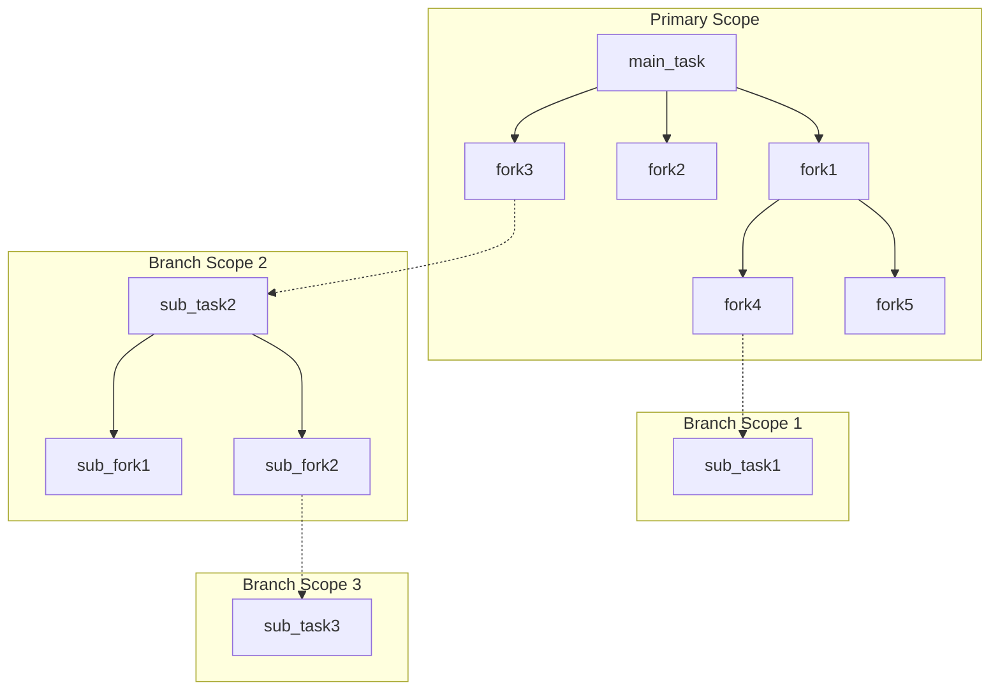
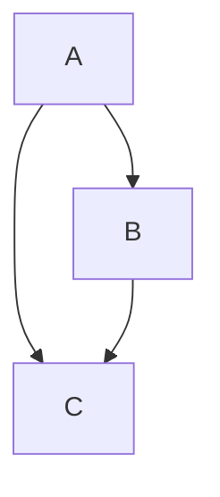

# Why Coflux

## Introduction

A newcomer learns about C++20 coroutines and decides to wrap a task to represent the coroutine.

Being clever, he utilizes two design principles: RAII and rvalue semantics. So he designs the following code:
`vector<int> a = co_await std::move(b)`

The intent is: get the result of task `b` as an rvalue, then destroy `b`. Internally to `co_await`, `b` is moved into an awaiter. `b` will be destructed when the coroutine resumes. Unequivocally, `await_suspend` registers a callback for `b` to resume `a`.

A single-threaded task begins execution, and then the program crashes.

This is due to a simple reason: as `b`'s call stack unwinds, it resumes `a`. `a` wakes up, and simultaneously, the awaiter storing `b` is destructed, killing `b`. When `b`'s call stack returns, it enters an already freed memory address.

Simply put, the call stack unwound, destroying its caller.

## Structured Concurrency: task/fork Model

In an asynchronous environment, we generally expect a task's lifecycle to be strictly confined to a scope with a definite boundary. This is the core idea of Coflux: a complete concurrent scope that, upon destruction, releases everything inside it at once.

Let's solve the problem faced by the newcomer above. If the lifetime of `b` belongs to `a`, it will be destructed along with `a`, rather than relying on call stack RAII which leads to a crash. This ensures that `a` only retrieves `b`'s result as an rvalue, rather than destroying it.

More broadly, we need to establish a Directed Acyclic Graph (DAG) based on the dependencies of asynchronous tasks. This graph has two types of nodes: *ownership nodes* and *non-ownership nodes*. In Coflux, these are called **task** and **fork**, respectively.

This is the task/fork model.

A `fork` can only be created by a single parent scope (a `task` or a higher-level `fork`). Its lifetime is bound to a concurrent scope from its moment of birth. A `task`, however, does not necessarily represent only the root node; it can be a child scope within a parent scope that is intended to be immediately consumed.



The diagram demonstrates a tree-like dependency. For the complete DAG dependency relationship, please refer to the "fork\_view" section.

### Value Semantics Model: co\_await Receives Value

For `co_await`, Coflux defines three fundamental value semantics:

`co_await std::move(coflux::task)`
Represents immediate consumption of a `task` and retrieving its result as an rvalue.

`co_await std::move(coflux::fork)`
Represents observing a `fork` and retrieving its result as an rvalue.

`co_await coflux::fork`
Represents observing a `fork` and retrieving its result as an lvalue.

`co_await` does not interfere with the `fork`'s lifecycle; the `fork` always follows the parent scope.

### fork\_view

Now consider a scenario:



C should not belong to both A and B simultaneously.

Coflux addresses the "conflict between lifetime dependencies and workflow dependencies" with the `fork_view` mechanism.

A `fork_view` is a lightweight, copyable, read-only view:
`co_await coflux::fork_view`
The result of the `co_await` expression should evidently be a constant lvalue.

If B and C both belong to A, and B reads C via a `fork_view`:

```c++
// in A
co_await B(...,C.get_view(),...);
// in B
auto c_res = co_await c_view;
```

A `fork_view`, as its name suggests, observes a `fork`. Therefore, a `fork_view` should not be taken out of the scope of the `fork` it observes. Otherwise, it will be Undefined Behavior: the `fork` observed by the `fork_view` has been destructed.

### The Non-Happy Path

We cannot guarantee that the workflow will always be smooth. Coflux aims for the task/fork model to be robust.

#### Exception Handling

Exceptions can be caught across threads, just as they pierce the call stack in synchronous tasks. If a `task`/`fork` throws an exception, the `co_await` call site will be notified. This relies on `std::exception_ptr`.
We also provide `then_with_result_or_error`/`then_with_or_error` (only for `task<void>`/`fork<void>`) for handling callback logic with the exception pointer.

#### Coroutine Cancellation

Coflux cancellation is **cooperative**.
When a `task` or `fork` is cancelled, the cancellation propagates down the chain to all child `fork`s. Child `fork`s retrieve the cancellation information via:
`co_await coflux::this_fork::get_stop_token()`
And then call:
`co_await coflux:this_fork::cancel()`
If a rogue `fork` does not accept the cancellation message, the parent will still politely wait for it to complete upon destruction.
The Combiner (`<combiner.hpp>`) defines `when_any`/`when_all`.
These redirect the original `stop_source` transmission relationship from Parent-\>Child to Parent-\>combiner-\>Child.

## Task as Context

The Coflux design philosophy is: if a `task` describes a concurrent scope, it should be more than just a lifetime ownership node.

A `task` fully maintains an execution context and an `std::pmr::memory_resource` pointer.

Therefore, there is no external entity called *context*. The task *is* the context.

### Heterogeneous Execution

The design vision of Coflux is to partition a complete job into multiple `fork`s that eventually converge back to the `task`. This is evidently heterogeneous, supported by the executor and scheduler.

#### Executor

The executor is extensible. Any class possessing the following public member function can be an executor (i.e., satisfy the *executive* concept).

```c++
template <typename Func, typename...Args>
auto execute(Func&&, Args&&...);
```

The return value of `execute` is completely ignored by Coflux.

#### Scheduler

A `task` and its child `fork`s may very likely be in different execution contexts. Therefore, we need a scheduler, encapsulated within the `task` scope, to coordinate this.

The scheduler describes a cluster of executors.

```c++
template <executive...Executors>
class scheduler;

template <executive...Executors>
class scheduler<Executors...> {...};

template <>
class scheduler<void> {...};
```

A `task` holds the first specialization of the scheduler: a clear and complete type.
A `fork` holds the second specialization of the scheduler: a type-erased proxy.

This proxy is non-intrusive (i.e., it doesn't rely on `virtual`). `scheduler<void>` is extremely lightweight, containing only an instance pointer and a VTABLE pointer. The VTABLE pointer is generated by a `scheduler<Executors...>` instance.

The complete signature for `task`/`fork`:

```c++
template <typename Ty, executive_or_certain_executor Executor, schedulable Scheduler>
class task;

template <typename Ty, executive_or_certain_executor Executor>
class fork;
```

The `Executor` parameter specifies the execution context desired by the user for the current `task`/`fork`. This can be:

1.  A concrete executor type, such as `coflux::noop_executor`.
    By default, Coflux will find the first occurrence of this type in the scheduler.
2.  A specific typed index, such as `coflux::index<coflux::noop_executor, 2>`.
    This will find the executor at index 2 within the scheduler and attempt to interpret it as `noop_executor`. Due to the type-erasure design of `scheduler<void>`, it is necessary to provide type information, and it also aids readability.

When a `task`/`fork` is created, it automatically mounts itself onto the corresponding `Executor`. For illustration, the pseudo-code is:

```c++
exec_.execute([my_handle]() { my_handle.resume(); });
```

#### make\_fork

Coflux designs the `make_fork` factory function, which can package any synchronous work into a `fork` for heterogeneous execution.

Precisely, `make_fork` is a "factory of factories": the return value of `make_fork` is a lambda expression that returns a `fork`. Thus, the synchronous work wrapped by `make_fork` can be reused.
If the synchronous work is stateful (e.g., a lambda with a capture list), that state is shared among all `fork`s. In this scenario, Coflux does not guarantee atomic access to the state.

```c++
auto&& env = co_await coflux::this_task::environment(); // See "environment protocol"
auto my_work1 = coflux::make_fork<coflux::noop_executor>(fun1, env);
co_await my_work1(1);
co_await my_work1(2);
// or
co_await coflux::make_fork<coflux::noop_executor>(fun1, env)(3);
```

### Environment Protocol

The environment protocol connects the complete structured concurrency and heterogeneous execution system:

1.  The first parameter of a `task` must be the return value of
    `coflux::make_environment(...);`.
2.  The first parameter of a `fork` must be the return value of
    `co_await coflux::this_task/this_fork::environment();`.

The return types of these two functions are different.

`template <schedulable Scheduler> make_environment(Scheduler&& sch,std::pmr::memory_resource* memo = std:::pmr::get_default_resource())`
The function receives a `scheduler` and a memory resource pointer (`std::pmr::memory_resource*`).
Each `task` copies this information locally to guarantee a complete execution context (the scheduler uses `shared_ptr` internally).
This means the parameter can be shared by multiple tasks.

`co_await coflux::this_task/this_fork::environment()`
Accepts no values. `this_task`/`this_fork` is determined by the parent environment, which is controlled by static tag dispatch. This parameter controls the construction of the DAG, and therefore, the first parameter of a `fork` must accept it by reference. The `fork` also obtains the type-erased scheduler and the parent environment's memory resource pointer here.

All `task`/`fork`s are constructed onto the space provided by the `std::pmr::memory_resource*`, which opens up possibilities for more advanced memory control.

## Static Channels

"Structured Concurrency" and "Task as Context" together derive the Coflux design philosophy: "**Static Channels**." Coflux aims to describe a static ownership system at compile time, so that once execution begins, everything happens orderly and immediately. This is why:

1.  Executor and scheduler are expressed as template parameters.
2.  All work is hot-started (`std::suspend_never`).
3.  `task`/`fork` are essentially different aliases of the same template: only the ownership parameters of the template differ.

## Future Directions

The above is the answer to "Why Coflux."
For the further development of this framework:

1.  Exploration in classic asynchronous work environments such as net/rpc.
2.  Further performance optimization (lock-free queues, affinity coroutine memory pools, etc.).
3.  More ergonomic API design.
4.  Completion of benchmarks and unit tests.
5.  Fixing hidden bugs and race conditions.