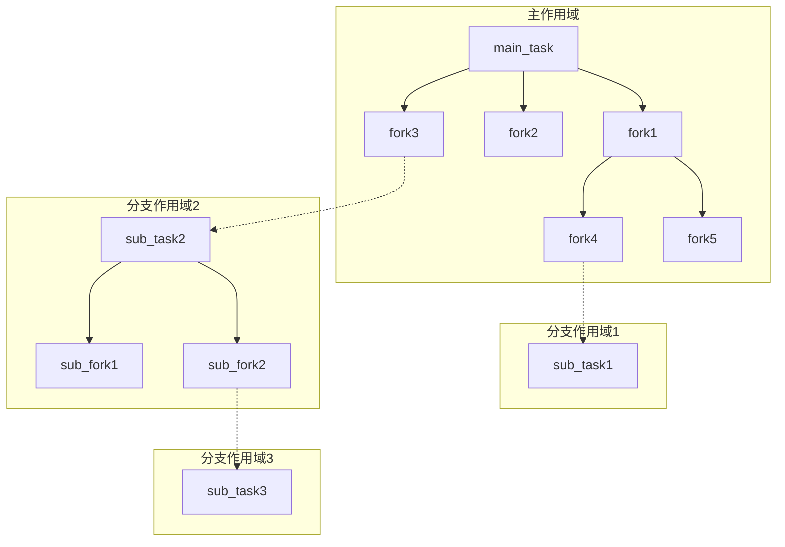
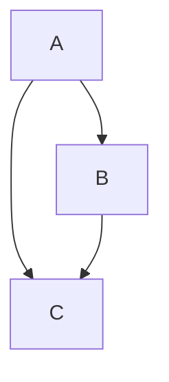

# Why Coflux
## 引言

一个新人了解了C++20协程，然后想封装一个task来表示这个协程。

他很聪明，利用了两个设计：RAII和右值语义。于是他设计了这样的代码：
`vector<int> a = co_await std::move(b)`
看来他的意思是：以右值获取到b任务的结果，然后销毁b。在co_await的内部，b被移动到了一个awaiter的内部，b将会在协程恢复时被析构，毋庸置疑，await_suspend给b注册了一个回调，作用是唤醒a。

于是一个单线程的任务开始运行，然后程序崩溃了。

因为一个很简单的原因：b 的调用栈展开时，它恢复了a，然后a苏醒，同时存储了b的awaiter被析构，b也一起死亡。当b的调用栈返回时，它进入了一个已经释放了的内存地址。

简单来讲，调用栈展开时，销毁了它的调用者。

## 结构化并发：task/fork模型

通常情况下我们希望在异步工作环境下，一个任务的生命周期应该被严格限制在一个有确切边界的范围。这就是coflux的想法：一个完整的并发作用域，在它析构时，一次性释放掉其内部所有东西。

我们来解决一下上面那个新人遇到的困难。如果b的生命是从属于a的，它就会跟随a被析构，而不是依赖调用栈RAII进而导致崩溃。这就让a只是以右值获取了它的结果，而不是销毁了它。

更宏观的讲，我们要基于异步任务的依赖关系建立一个有向无环图（DAG），这张图上有两种节点：所有权节点和非所有权节点。在coflux中，它们分别被称为task和fork。

这就是task/fork模型。

一个fork只能被一个父作用域（一个task或一个更高级的fork）创建。它从出生起就与一个并发作用域的生命绑定在一起。而一个task不一定只表示根节点，它完全可以是一个作用域中的一个要被立即消耗的子作用域。


图中演示了一个树形的依赖关系。完整的DAG依赖关系请参阅“fork_view”一节。
### 值语义模型：co_await接收值
对于co_await， coflux定义三种基本的值语义：

`co_await std::move(coflux::task)`
表示立即消耗一个task，并从右值获取它的结果。

`co_await std::move(coflux::fork)`
表示观察一个fork，并从右值获取它的结果。

`co_await coflux::fork`
表示观察一个fork，并从左值获取它的结果。

co_await不干扰fork的生命周期，fork永远跟随父作用域。

### fork_view

那现在有一个情景：

C不应该同时属于A和B。

coflux以fork_view的方法处理“生命周期依赖关系和工作流程依赖关系的矛盾”。

fork_view是一份轻量级可拷贝的只读视图:
`co_await coflux::fork_view`
很显然co_await表达式的值应该是常量左值。

如果，B和C同属于A，B以fork_view的形式读取C:
```C++
// in A
co_await B(...,C.get_view(),...);
// in B
auto c_res = co_await c_view;
```

fork_view，正如它的名字，观察着一个fork，因此不应该将fork_view带出其所观察的fork的作用域。否则将是一个未定义行为：fork_view所观察的fork已经析构。

### 非快乐路径
我们不能保证工作流总是顺利的，coflux希望task/fork模型是健壮的。

#### 异常处理

异常可以跨线程捕获，就如同同步任务重异常击穿调用栈一样。如果某个task/fork抛出了异常，那么co_await调用处会知晓。这依赖于std::exception_ptr。
同时提供then_with_result_or_error/then_with_or_error（only for task<void>/fork<void>）,用于处理异常指针的回调逻辑。

#### 协程取消

coflux的取消是协作式的。
当一个task或fork取消时，它链式传播给所有子fork。子fork通过
`co_await coflux::this_fork::get_stop_token()`
获取到取消信息。然后调用：
`co_await coflux:this_fork::cancel()`
如果有流氓fork不接受取消信息，父类析构时仍然礼貌地等待它完成。
组合器<combiner.hpp>定义了when_any/when_all。
他们会将原有的stop_source传递关系由Parent->Child转接为Parent->combiner->Child。

## 任务即上下文

coflux的设计思想是：如果一个task描述了一个并发作用域，它就不应该只是一个生命周期所有权节点而已。

一个task完整维护了一份执行上下文和一份std::pmr::memory_resource指针。

因此，不存在一个处在外界的，名为context的东西。task就是context。

### 异构执行

将一个完整的工作切割为多个fork，最后汇聚回task是coflux的设计愿景。显然这是异构的：由executor和scheduler支持。


#### executor

executor是可扩展的，任何具有以下public成员函数的类都可以成为executor（也就是满足executive概念）。
```C++
template <typename Func, typename...Args>
auto execute(Func&&, Args&&...);
```
execute的返回值会被coflux完全忽视。

#### scheduler

task与其子fork很有可能处在不同的执行上下文中,于是我们需要有一个封闭在task作用域内的scheduler调控这件事。

scheduler描述了一个executor的集群。
```C++
template <executive...Executors>
class scheduler;

template <executive...Executors>
class scheduler<Executors...> {...};

template <>
class scheduler<void> {...};
```
一个task会持有scheduler的第一种偏特化：清晰完整的类型。
一个fork会持有scheduler的第二种偏特化：类型擦除的代理。

这种代理是非侵入式的，也就是不依赖virtual。scheduler<void>非常轻量，只包含一个实例指针和一个VTABLE指针。VTABLE指针由一个scheduler<Executors...>生成。

task/fork的完整签名：
```C++
template <typename Ty, executive_or_certain_executor Executor, schedulable Scheduler>
class task;

template <typename Ty, executive_or_certain_executor Executor>
class fork;
```

Executor参数指出了用户所希望当前task/fork的执行上下文，它可以是：
1. 一个具体的executor类型，如coflux::noop_executor。
   默认寻找scheduler的这种类型的第一次出现。
2. 一个具体的带类型索引，如coflux::index<coflux::noop_executor, 2>。
   这会找到scheduler中的下标为2处的executor，并尝试解释为noop_executor。因为scheduler<void>的类型擦除设计，有必要提供类型信息，同时也为可读性考虑。

当task/fork被创建时，它自动将自己挂载到对应的Executor上。为了便于说明，伪代码是：
```C++
exec_.execute([my_handle]() { my_handle.resume(); });
```

#### make_fork
coflux设计了make_fork工厂函数，它可以将任何同步工作打包成fork来进行异构执行。

精确地说，make_fork是一个“工厂的工厂"：make_fork的返回值是一个返回fork的lambda表达式：因此make_fork包装的同步工作可以重复使用。
如果同步工作有状态（如携带捕获列表的lambda），则该状态对所有fork共享，在这种情况下，coflux不保证对状态的访问是原子的。
```C++
auto env = co_await coflux::this_task::environment(); // 见“environment协议”
auto my_work1 = coflux::make_fork<coflux::noop_executor>(fun1, env);
co_await my_work1(1);
co_await my_work1(2);
//或者
co_await coflux::make_fork<coflux::noop_executor>(fun1, env)(3);
```

### environment协议

environment协议串联了完整的结构化并发与异构执行系统：
1. task的第一个参数必须是
   `coflux::make_environment(...);`
   的返回值。
2. fork的第一个参数必须是
   `co_await coflux::this_task/this_fork::environment();`
   的返回值。

这两个函数的返回值类型是不同的。

`
template <schedulable Scheduler>
make_environment(Scheduler&& sch,std::pmr::memory_resource* memo = std:::pmr::get_default_resource())
`
函数接收一份scheduler和一个内存资源指针（std::pmr::memory_resource*）。
每个task都会将这两个信息拷贝到本地，以保证完整的执行上下文（scheduler内部使用shared_ptr）。
这意味这个参数可以被多个task共享。

`co_await coflux::this_task/this_fork::environment()`
不接受任何值。this_task/this_fork由父环境确定，这是由静态标签派发控制的。此参数会控制DAG图的构建，因此fork的首个参数必须接受它。fork也在此获取类型擦除的scheduler和父环境的内存资源指针。

所有task/fork都会构造到std::pmr::memory_resource*提供的空间上，这为更进一步的内存控制提供了可能。

## 静态的沟渠

“结构化并发”和“任务即上下文”共同导出了coflux的设计理念：“静态的沟渠”。coflux旨在编译期描述一个静态的所有权系统，一旦开始执行，一切都有条不紊的立即发生。这也是为什么：

1. executor和scheduler作为模版参数被表达。
2. 所有工作都是热启动的（std::suspend_never）。
3. task/fork本质是同一份模版的不同别名：仅是模版的所有权参数有所区别。
   
## 面向未来
以上就是Why Coflux的答案。
对于本框架的进一步发展：
1. 在net/rpc等经典异步工作环境进行开拓。
2. 希望更进一步的性能优化（无锁队列、亲和协程的内存池等）。
3. 更有亲和力的API设计。
4. 完善基准测试和单元测试。
5. 修复隐藏的bug和竞态条件。