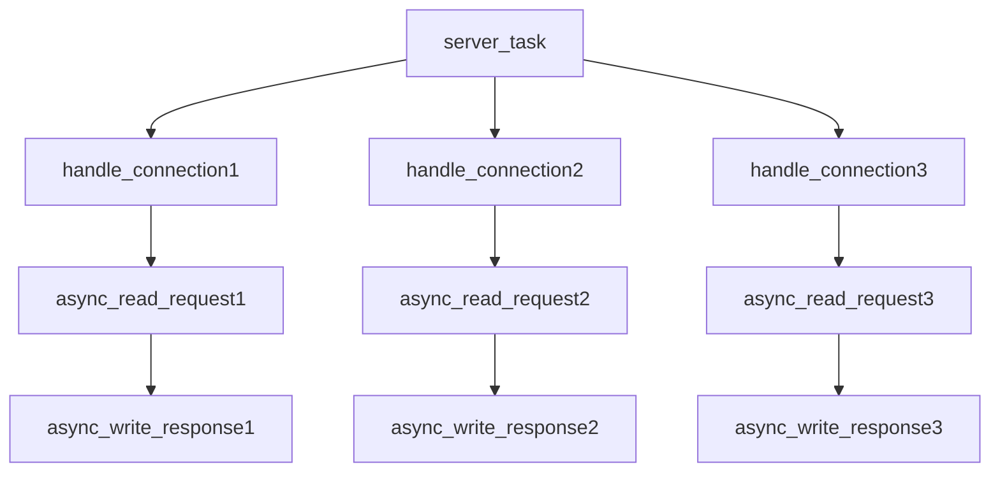

# Coflux: Coroutines Conflux

[](https://isocpp.org/)
[](https://opensource.org/licenses/MIT)


​

*A C++20 coroutine framework for building statically-defined, high-performance concurrent systems*

[中文版本](./README.zh.md)

## Introduction

Coflux is a modern concurrency framework built on C++20 coroutines.

Coflux features a **Structured Concurrency** `task/fork` model and a "**Task-as-Context**" design philosophy for heterogeneous computing. It aims to statically describe a safe and predictable concurrent system at compile time.

"Structured Concurrency" and "Task-as-Context" together articulate its core philosophy, "**Static Channels**": ensuring that all asynchronous work, once started, executes predictably along a pre-established path, much like water flowing through river channels.

## Core Features

  - **Structured Concurrency**: A generalized RAII-style lifecycle management. Each `task` derives child `fork`s via an `environment protocol`, syntactically preventing "orphan tasks."
  - **Task-as-Context**: There is no external `context`; each `task` is itself a complete, isolated execution environment that supports all related `fork` operations.
  - **Heterogeneous Execution**: The `scheduler` is designed as a templated cluster of `executor`s, allowing tasks within the same concurrency scope to execute in different contexts, highly decoupled from lifecycle management.
  - **PMR Memory Model**: Integration with `std::pmr` via the `environment protocol` allows users to inject custom, high-performance memory allocation strategies at runtime for different concurrency scopes.
  - **Modern C++ Design**: Fully leveraging modern C++ language features and advanced design, we pursue an elegant "maximum meaning, minimum words" philosophy in the source code.

## Quick Start

The example below demonstrates how to define a root task (`server_task`) running on the main thread (`noop_executor`), which then spawns three child task chains running on a thread pool (`thread_pool_executor`).

Because `noop_executor` does nothing, the task will resume on the `thread_pool_executor` until `co_return`. However, the main thread's RAII block will halt execution until all tasks are complete.

```c++
#include <iostream>
#include <coflux/task.hpp>
#include <coflux/scheduler.hpp>
#include <coflux/combiner.hpp>

using noop = coflux::noop_executor;
using pool = coflux::thread_pool_executor<>;
using sche = coflux::scheduler<noop, pool, coflux::timer_executor>;

// Simulate asynchronous network request reading
coflux::fork<std::string, pool> async_read_request(auto&&, int client_id) {
    std::cout << "[Client " << client_id << "] Waiting for request..." << std::endl;
    co_await std::chrono::milliseconds(200 + client_id * 100);
    co_return "Hello from client " + std::to_string(client_id);
}

// Simulate asynchronous network response writing
coflux::fork<void, pool> async_write_response(auto&&, const std::string& response) {
    std::cout << "  -> Echoing back: '" << response << "'" << std::endl;
    co_await std::chrono::milliseconds((rand() % 5) * 100);
    co_return;
}

// Handle a single connection using structured concurrency
coflux::fork<void, pool> handle_connection(auto&&, int client_id) {
    try {
        auto&& ctx = co_await coflux::context();
        auto request = co_await async_read_request(ctx, client_id);
        auto processed_response = request + " [processed by server]";
        co_await async_write_response(ctx, processed_response);
        std::cout << "[Client " << client_id << "] Connection handled successfully." << std::endl;
    }
    catch (const std::exception& e) {
        std::cerr << "[Client " << client_id << "] Error: " << e.what() << std::endl;
    }
    // When handle_connection finishes, all forks it created (read/write) are automatically cleaned up.
}

int main() {
    auto env = coflux::make_environment<sche>();
    auto server_task = [](auto& env) -> coflux::task<void, noop, sche> {
        std::cout << "Server task starting 3 concurrent connections...\n";
        co_await coflux::when_all(
            handle_connection(co_await coflux::context(), 1),
            handle_connection(co_await coflux::context(), 2),
            handle_connection(co_await coflux::context(), 3)
        );
        std::cout << "All connections handled.\n";
        }(env);
    // RAII block waits for the entire server task to complete
    return 0;
}
```



## Core Philosophy

Coflux's design is driven by several core principles:

* **Structured Concurrency** based on the *task/fork* model, which eliminates orphan tasks and memory leaks.

* *PMR* support and *heterogeneous execution* based on the **Task-as-Context** model.

* **The Static Channels** philosophy: pursuing *zero-cost abstraction* to describe an asynchronous concurrent system as fully as possible at compile time.

To delve into the rationale behind **Structured Concurrency**, **Task-as-Context**, and "**Static Channels**," please read the **[Design and Architecture Document (ARCHITECTURE.md)](./ARCHITECTURE.en.md)**.

## Performance: Near-Zero Overhead

Coflux is engineered for extreme performance, targeting systems that must minimize the overhead of creating, scheduling, and managing asynchronous tasks. Our **Task-as-Context** model and deep **PMR (Polymorphic Memory Resource) integration** are key to this achievement.

Micro-benchmarks, conducted on an **AMD Ryzen 9 7940H (8 Cores/16 Threads, 5.2GHz)** using the `noop_executor`, showcase Coflux's capability:

  * 🚀 **Theoretical Peak (Monotonic Allocator):** Capable of completing **over 14 million** `fork` creation-execution-destruction cycles per second, with core framework overhead **below 70 nanoseconds** per `fork`. This demonstrates the raw potential when memory allocation cost is virtually zero.
  * ⚙️ **Practical Throughput (Pool Allocator):** Sustains nearly **4 million** complete creation-**destruction** cycles per second (including returning memory to the pool). This highlights excellent performance (approx. 250 nanoseconds per round trip) and cache efficiency in scenarios requiring memory reuse.

These results confirm that the overhead introduced by Coflux is negligible, quickly reaching hardware limits (CPU cache bottleneck). It provides a robust, high-performance foundation for demanding concurrent applications.

For detailed methodology, hardware specifications, and complete data analysis, please refer to **[BENCHMARK.md](./BENCHMARK.en.md)**.

## Installation and Usage

### Requirements

  - A C++20 compliant compiler (MSVC v19.29+, GCC 11+, Clang 13+).

### Installation

Coflux is a **header-only library**. You only need to add the `include` directory to your project's include paths.

### CMake Integration

We recommend using CMake's `FetchContent` to integrate Coflux into your project:

```cmake
# In your CMakeLists.txt

include(FetchContent)
FetchContent_Declare(
    coflux
    GIT_REPOSITORY [https://github.com/dakingffo/coflux.git](https://github.com/dakingffo/coflux.git)
)
FetchContent_MakeAvailable(coflux)

# ... In your target
target_link_libraries(your_target PRIVATE coflux)
```

## Future Directions

For the further development of this framework:

1.  Exploration in classic asynchronous work environments such as net/rpc.
2.  Further performance optimization (lock-free queues, affinity coroutine memory pools, etc.).
3.  More ergonomic API design.
4.  Further refinement of benchmarks and unit tests.
5.  Fixing hidden bugs and race conditions.


## Contribution

Contributions in any form are welcome\! Whether it's submitting bug reports, feature suggestions, or Pull Requests.
We will finalize the CONTRIBUTING document in the near future\! More information will be available then.

## License

Coflux is licensed under the [MIT License](../LICENSE.txt).