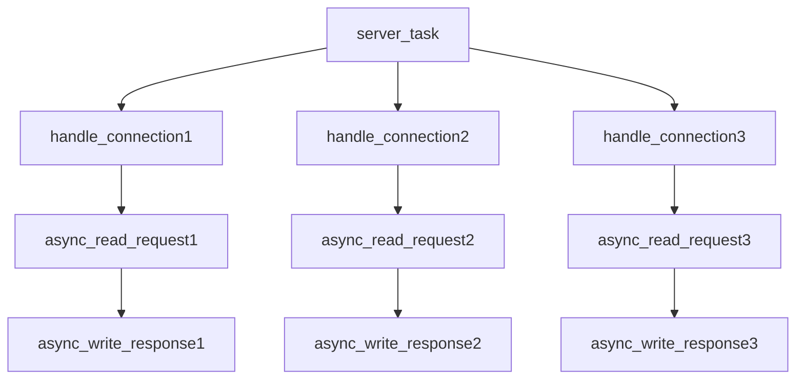
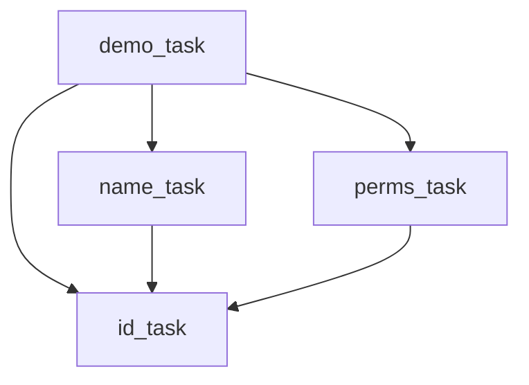

# Coflux：Coroutines Conflux

[](https://isocpp.org/)
[](https://opensource.org/licenses/MIT)


​


*一个用于构建静态定义、高性能并发系统的C++20协程框架*
<br>
*A C++20 coroutine framework for building statically-defined, high-performance concurrent systems*

[English Version](./README.en.md) 

## 简介

Coflux是一个基于C++20协程构建的现代并发框架。

Coflux设计了**结构化并发**的`task/fork`模型和“**任务即上下文**”的异构计算设计思路，旨在编译期就静态地描述一个安全、可预测的并发系统。

“结构化并发”和“任务即上下文”共同阐述了其核心理念“**静态的沟渠**”：确保所有异步工作在启动后，都能沿着预设的路径有条不紊地执行，如同河道沟渠的水流运作一样。

## 核心特性

- **结构化并发**: 更广义RAII式生命周期管理，每个`task`通过`environment协议`派生子`fork`，在语法层面杜绝“孤儿任务”。
- **任务即上下文**: 不存在外界的`context`，每个`task`自身即为一个完整的、隔离的执行环境，支撑所有fork的运作。
- **异构执行**: `scheduler`被设计为模版化的`exeucotr`集群，使得同一个并发作用域内的任务可以拥有在不同的执行上下文，且与生命管理高度解耦。
- **PMR内存模型**: 通过`environment协议`集成`std::pmr`允许用户在运行时为不同的并发作用域注入自定义的、高性能的内存分配策略。
- **现代C++设计**: 利用现代C++的语言特性和高级设计，我们追求源码“微言大义”的优雅程度。

## 核心理念

Coflux的设计由几个核心理念驱动。
* 基于**task/fork模型结构化并发**，杜绝孤儿任务和内存泄漏。
* 基于**任务即上下文**的*pmr*支持和*异构执行*支持。
* **静态的沟渠**理念：追求*零开销抽象*，在编译期最大程度描述一个异步并发系统。

要深入了解**结构化并发**、**任务即上下文**和“**静态的沟渠**”的提出，请阅读 **[设计与架构文档 (ARCHITECTURE.md)](./ARCHITECTURE.zh.md)**。

## 性能摘要

Coflux 的设计理念是 **“静态的沟渠”**，其性能目标是提供**微小的抽象开销**和**高效的多核扩展能力**。以下关键数据证明了 Coflux 在 C++20 协程运行时领域的水准：

| 核心指标 | 结果 | 意义 |
| :--- | :--- | :--- |
| **单任务核心开销** | $\mathbf{\sim 256 \text{ 纳秒}}$ / Fork | 框架核心机制**极度轻量**，一个协程生命周期成本极低。 |
| **M:N 调度净增开销** | **$\mathbf{\sim 257 \text{ 纳秒}}$** | Work-Stealing 调度器仅用极小的代价，就将任务**高效扩展到多核环境**。 |
| **高并发吞吐量** | **$\mathbf{\sim 1.95 \text{ 万次/秒}}$** | 在高竞争负载下，保持了 **1.95 M/s** 的稳定吞吐，证明了同步机制的**鲁棒性**。 |
| **序列依赖处理** | **$\mathbf{\sim 1 \text{ 微秒}}$** / 阶段 | 完整的协程挂起-调度-恢复循环延迟极低，**适用于 I/O 密集型 Pipeline**。 |

有关详细的方法论、硬件规格和完整的数据分析，请参阅 **[BENCHMARK.md](./BENCHMARK.zh.md)**。

## Coflux 的核心价值

* **极致微开销**: 将异步任务的整个生命周期成本（包括协程帧、PMR 内存、结构化销毁）控制在 $\mathbf{300 \text{ 纳秒}}$ 级。
* **高效且可预测的并发**: Work-Stealing 调度器以极低成本实现**安全的多核扩展**，并完美兼容 C++ PMR，避免了传统并发模型中的性能瓶颈。
* **结构化并发保障**: 结合高性能数据，Coflux 提供了**安全、可预测、高吞吐量**的 C++20 协程运行时环境。

## 快速上手

1. **结构化并发**
   
下面的示例展示了如何定义一个发生在主线程(`noop_executor`)的根任务(`server_task`)，并由它派生出三条在线程池(`thread_pool_executor`)上运行的子任务链。

因为`noop`不做任何事，因此`task`协程帧会恢复在`thread_pool_executor`上，直到`co_return`。但主线程的RAII会阻塞直到所有任务完成。

```C++
#include <iostream>
#include <string>
#include <coflux/scheduler.hpp>
#include <coflux/combiner.hpp>
#include <coflux/task.hpp>

using pool = coflux::thread_pool_executor<>;
using timer = coflux::timer_executor;
using sche = coflux::scheduler<pool, timer>;

// 模拟异步读取网络请求
coflux::fork<std::string, pool> async_read_request(auto&&, int client_id) {
    std::cout << "[Client " << client_id << "] Waiting for request..." << std::endl;
    co_await std::chrono::milliseconds(200 + client_id * 100);
    co_return "Hello from client " + std::to_string(client_id);
}

// 模拟异步写回网络响应
coflux::fork<void, pool> async_write_response(auto&&, const std::string& response) {
    std::cout << "  -> Echoing back: '" << response << "'" << std::endl;
    co_await std::chrono::milliseconds((rand() % 5) * 100);
    co_return;
}

// 使用结构化并发处理单个连接
coflux::fork<void, pool> handle_connection(auto&&, int client_id) {
    try {
        auto&& env = co_await coflux::context();
        auto request = co_await async_read_request(env, client_id);
        auto processed_response = request + " [processed by server]";
        co_await async_write_response(env, processed_response);
        std::cout << "[Client " << client_id << "] Connection handled successfully." << std::endl;
    }
    catch (const std::exception& e) {
        std::cerr << "[Client " << client_id << "] Error: " << e.what() << std::endl;
    }
    // 当 handle_connection 结束时，所有它创建的 fork (read/write) 都会被自动清理
}

int main() {
    std::cout << "--- Demo: Structured Concurrency with when_all ---\n";
    {
        auto env = coflux::make_environment<sche>(pool{ 4 }, timer{});
        auto server_task = [](auto env) -> coflux::task<void, pool, sche> {
            std::cout << "Server task starting 3 concurrent connections...\n";
            co_await coflux::when_all(
                handle_connection(co_await coflux::context(), 1),
                handle_connection(co_await coflux::context(), 2),
                handle_connection(co_await coflux::context(), 3)
            );
            std::cout << "All connections handled.\n";
            }(env);
        // server_task 析构时，RAII 会自动阻塞 main 线程，
        // 直到 server_task 及其所有子 fork (handle_connection) 全部完成。
    }
    std::cout << "\n--- Demo Finished ---\n";
    return 0;
}
```


2. **`co_await` 与 `on_xxx`的混合风格**
   
下面的示例展示了同时使用协程风格和回调风格的异步代码。
形如`auto res = co_await std::move(t).on_xxx().on_xxx()`的代码描述了“即用即配”的快速路径。
coflux保证以非阻塞的方式实现co_await晚于所有on_xxx调用，这是为了符合值语义模型:`on_value`的接收值由内部的左值拷贝得到，而res将被以t的右值结果赋值。

为了模拟同步情况下的异常抛出，Coflux保证具体的异常只能被跨线程捕获或on_error消耗一次，此后，重复调用`get_result`将会抛出`std::runtime_error("Can't get result because there is an exception.")`。
```C++
#include <iostream>
#include <string>
#include <coflux/scheduler.hpp>
#include <coflux/task.hpp>

using pool = coflux::thread_pool_executor<>;
using timer = coflux::timer_executor;
using sche = coflux::scheduler<pool, timer>;

// 辅助函数：模拟异步IO
coflux::fork<std::string, pool> async_fetch_data(auto&&, std::string data, std::chrono::milliseconds delay) {
    co_await delay;
    co_return "Fetched$" + data;
}

// 辅助函数：模拟异步IO（会失败）
coflux::fork<std::string, pool> async_fetch_data_error(auto&&) {
    co_await std::chrono::milliseconds(50);
    throw std::runtime_error("Data fetch failed!");
    co_return "";
}

int main() {
    std::cout << "--- Demo: Mixed Style (co_await + Chaining) ---\n";
    {
        auto env = coflux::make_environment<sche>(pool{ 2 }, timer{});
        auto launch = [&](auto env) -> coflux::task<void, pool, sche> {
            auto ctx = co_await coflux::context();
            std::atomic<bool> success_called = false;
            std::atomic<bool> error_called = false;

            // 演示成功路径
            std::cout << "Awaiting success task with .on_value()...\n";
            std::string result = co_await async_fetch_data(ctx, "SuccessData", std::chrono::milliseconds(50))
                .on_value([&](const std::string& s) {
                std::cout << "  [on_value callback] Fired for: " << s << "\n";
                success_called = true;
                    })
                .on_error([&](auto) { // 不会执行
                });
            std::cout << "  [co_await result] Got: " << result << "\n";

            // 演示失败路径
            std::cout << "Awaiting error task with .on_error()...\n";
            try {
                // co_await 一个右值 task
                co_await async_fetch_data_error(ctx)
                    .on_value([&](auto) { // 不会执行
                    })
                    .on_error([&](std::exception_ptr e) {
                    std::cout << "  [on_error callback] Fired! Exception consumed.\n";
                    error_called = true;
                        });
            }
            catch (const std::runtime_error& e) {
                // 异常被 on_error 处理后，get_result() 会抛出 No_result_error
                std::cout << "  [co_await catch] Correctly caught: " << e.what() << "\n";
            }

            assert(success_called.load());
            assert(error_called.load());
            };
        auto demo_task = launch(env);
        // RAII 析构 会等待 demo_task 完成
    }

    std::cout << "\n--- Demo Finished ---\n";
    return 0;
}
```
3. **同步包装器`make_fork`与`fork_view`构建DAG图依赖关系**
   
下面的示例演示了将同步任务打包成`fork`并指定其`executor`的过程。

fork_view可以在同一个task的作用域内传递，用于观察一个fork的结果，这意味着可以构成复杂的依赖图。

```C++
#include <iostream>
#include <string>
#include <coflux/scheduler.hpp>
#include <coflux/task.hpp>
#include <coflux/combiner.hpp>

using pool = coflux::thread_pool_executor<>;
using timer = coflux::timer_executor;
using sche = coflux::scheduler<pool, timer>;

int main() {
    std::cout << "--- Demo: `make_fork` and `fork_view` Dependency Graph ---\n";
    {
        auto env = coflux::make_environment<sche>(pool{ 3 }, timer{});

        // 1. 定义同步/异步的 callables
        // 包装一个 "std::" 函数 (或类似的同步lambda)
        auto sync_fetch_user_id = [](const std::string& username) -> int {
            std::cout << "  [Task A] (Sync) Fetching ID for '" << username << "'\n";
            std::this_thread::sleep_for(std::chrono::milliseconds(10));
            return std::stoi(username.substr(username.find_first_of('$') + 1));
            };
        // B 和 C 依赖 A 的结果
        auto fetch_user_name = [](auto&&, coflux::fork_view<int> id_view) -> coflux::fork<std::string, pool> {
            int id = co_await id_view;
            std::cout << "  [Task B] (Async) Getting name for ID " << id << "\n";
            co_return "Daking";
            };
        auto fetch_user_perms = [](auto&&, coflux::fork_view<int> id_view) -> coflux::fork<std::string, pool> {
            int id = co_await id_view;
            std::cout << "  [Task C] (Async) Getting perms for ID " << id << "\n";
            co_return "Admin";
            };

        auto launch = [&](auto env) -> coflux::task<void, pool, sche> {
            auto ctx = co_await coflux::context();

            // 2. 用 make_fork 将同步函数 "fork化"
            auto get_id_fork_factory = coflux::make_fork<pool>(sync_fetch_user_id, ctx);

            // 3. 执行图
            auto id_task = get_id_fork_factory("daking$123");
            auto id_view = id_task.get_view(); // 共享结果

            // 4. B 和 C 并发启动
            auto name_task = fetch_user_name(ctx, id_view);
            auto perms_task = fetch_user_perms(ctx, id_view);

            // 5. 等待最终结果
            auto [name, perms] = co_await coflux::when_all(name_task, perms_task);
            std::cout << "  [Result] User: " << name << ", Permissions: " << perms << "\n";
            };
        auto demo_task = launch(env);
        // RAII 析构 等待完成
    }
    std::cout << "\n--- Demo Finished ---\n";
    return 0;
}
```

4. **`when(n)异步流水线`**

下面的示例演示了异步数据流通过`co_await(vec | when(n))`的形式非阻塞地参与到同步调用链中(与`ranges`集成)。

`co_await`作为一个同步点串联了异步环境与同步环境:将异步任务解析为同步结果。
   
```C++
#include <iostream>
#include <string>
#include <coflux/scheduler.hpp>
#include <coflux/combiner.hpp>
#include <coflux/task.hpp>

using pool = coflux::thread_pool_executor<>;
using timer = coflux::timer_executor;
using sche = coflux::scheduler<pool, timer>;

// 辅助函数：模拟异步IO
coflux::fork<std::string, pool> async_fetch_data(auto&&, std::string data, std::chrono::milliseconds delay) {
    co_await delay;
    co_return "Fetched$" + data;
}

int main() {
    std::cout << "--- Demo: Async Pipeline with `when(n)` ---\n";
    {
        auto env = coflux::make_environment<sche>(pool{ 5 }, timer{});

        auto launch = [&](auto env) -> coflux::task<void, pool, sche> {
            auto ctx = co_await coflux::context();
            std::vector<coflux::fork<std::string, pool>> downloads;

            // 启动5个下载任务，速度不同
            downloads.push_back(async_fetch_data(ctx, "File 1 (200ms)", std::chrono::milliseconds(200)));
            downloads.push_back(async_fetch_data(ctx, "File 2 (50ms)", std::chrono::milliseconds(50)));
            downloads.push_back(async_fetch_data(ctx, "File 3 (300ms)", std::chrono::milliseconds(300)));
            downloads.push_back(async_fetch_data(ctx, "File 4 (10ms)", std::chrono::milliseconds(10)));
            downloads.push_back(async_fetch_data(ctx, "File 5 (70ms)", std::chrono::milliseconds(70)));

            std::cout << "Starting 5 downloads, waiting for the first 3 to complete...\n";

            // `co_await(vec | when(n))`
            // 等待5个任务中【最快完成】的3个，处理掉前缀"Fetched$"
            std::cout << "\n  [Result] The first 3 completed files were:\n";
            for (const auto& s : co_await(downloads | coflux::when(3)) |
                std::views::transform([](auto&& s) { return s.substr(s.find_first_of('$') + 1); }))
            {
                std::cout << "  -> " << s << "\n";
            }
            };
        auto demo_task = launch(env);
        // RAII 析构 等待所有任务（包括未被 co_await 的）完成
    }
    std::cout << "--- Demo Finished ---\n";
    return 0;
}
```
5. **生成器循环与递归**

下面的示例展示了`coflux::generator`支持的两种生成策略:循环与递归。
`coflux::generator`模仿`input_range`，可以集成到`std::ranges`。

Colfux支持不同的生成器相互递归调用，只要返回类型相同。
```C++
#include <iostream>
#include <string>
#include <ranges>
#include <coflux/generator.hpp>

// === 生成器示例 ===
coflux::generator<int> fibonacci(int n) {
    int a = 0, b = 1;
    for (int i = 0; i < n; ++i) {
        co_yield a;
        int next = a + b;
        a = b;
        b = next;
    }
}

coflux::generator<int> recursive_countdown(int n, auto&& fibonacci) {
    if (n > 0) {
        co_yield fibonacci(n);
        co_yield recursive_countdown(n - 1, fibonacci);
    }
};

int main() {
    std::cout << "--- Demo: Generators (Loop & Recursion) ---\n";
    {
        // 循环 (Loop)
        std::cout << "Looping (Fibonacci):\n  ";
        auto view = fibonacci(15)
            | std::views::filter([](int n) { return n % 2 == 0; })
            | std::views::take(5)
            | std::views::transform([](int n) { return n * n; });
        for (int val : view) { std::cout << val << " "; }

        // 递归 (Recursion)
        std::cout << "\nRecursion (Countdown):\n  ";
        for (int val : recursive_countdown(5, fibonacci)) {
            std::cout << val << " ";
        }
        std::cout << "\n";
    }

    std::cout << "\n--- Demo Finished ---\n";
    return 0;
}
```

## 安装与使用

### 要求
- 支持C++20的编译器 (MSVC v19.29+, GCC 11+, Clang 13+)。

### 安装
Coflux是一个**纯头文件库**，您只需要将`include`目录添加到您的项目包含路径中即可。

### CMake集成
推荐使用CMake的`FetchContent`来集成Coflux到您的项目中：

```cmake
# In your CMakeLists.txt

include(FetchContent)
FetchContent_Declare(
    coflux
    GIT_REPOSITORY [https://github.com/dakingffo/coflux.git](https://github.com/dakingffo/coflux.git)
)
FetchContent_MakeAvailable(coflux)

# ... In your target
target_link_libraries(your_target PRIVATE coflux)
```

## 面向未来
对于本框架的进一步发展：
1. 在net/rpc等经典异步工作环境进行开拓。
2. 希望更进一步的性能优化（无锁队列、亲和协程的内存池等）。
3. 更有亲和力的API设计。
4. 进一步完善基准测试和单元测试。
5. 修复隐藏的bug和竞态条件。

## 贡献

欢迎任何形式的贡献！无论是提交Bug报告、功能建议还是Pull Request。
我们将会在不久的未来完善CONTRIBUTING文档！届时可以获取更多信息。

## 许可证

Coflux 使用 [MIT License](../LICENSE.txt) 授权。