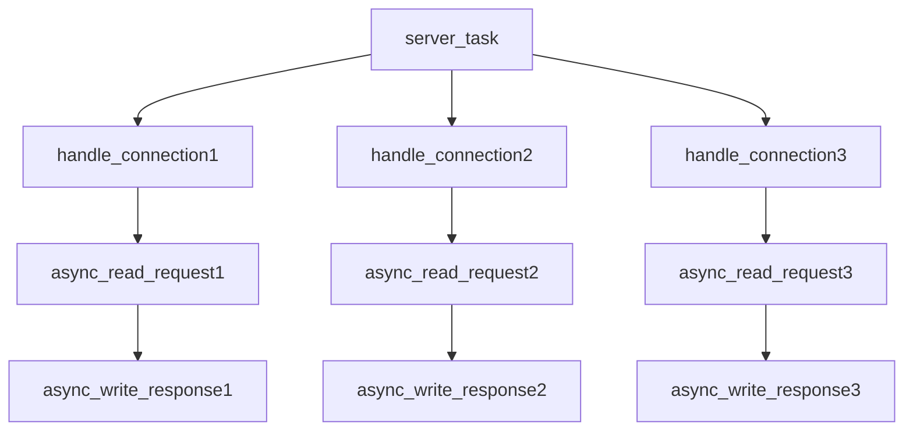

# Coflux：Coroutines Conflux

[](https://isocpp.org/)
[](https://opensource.org/licenses/MIT)


​

*一个用于构建静态定义、高性能并发系统的C++20协程框架*
<br>
*A C++20 coroutine framework for building statically-defined, high-performance concurrent systems*

[English Version](./README.en.md) 

## 简介

Coflux是一个基于C++20协程构建的现代并发框架。

Coflux设计了**结构化并发**的`task/fork`模型和“**任务即上下文**”的异构计算设计思路，旨在编译期就静态地描述一个安全、可预测的并发系统。

“结构化并发”和“任务即上下文”共同阐述了其核心理念“**静态的沟渠**”：确保所有异步工作在启动后，都能沿着预设的路径有条不紊地执行，如同河道沟渠的水流运作一样。

## 核心特性

- **结构化并发**: 更广义RAII式生命周期管理，每个`task`通过`environment协议`派生子`fork`，在语法层面杜绝“孤儿任务”。
- **任务即上下文**: 不存在外界的`context`，每个`task`自身即为一个完整的、隔离的执行环境，支撑所有fork的运作。
- **异构执行**: `scheduler`被设计为模版化的`exeucotr`集群，使得同一个并发作用域内的任务可以拥有在不同的执行上下文，且与生命管理高度解耦。
- **PMR内存模型**: 通过`environment协议`集成`std::pmr`允许用户在运行时为不同的并发作用域注入自定义的、高性能的内存分配策略。
- **现代C++设计**: 利用现代C++的语言特性和高级设计，我们追求源码“微言大义”的优雅程度。

## 快速上手

下面的示例展示了如何定义一个发生在主线程(`noop_executor`)的根任务(`server_task`)，并由它派生出三条在线程池(`thread_pool_executor`)上运行的子任务链。

因为noop不做任何事，因此task会恢复在thread_pool_executor上，直到co_return。但主线程的RAII会阻塞直到所有任务完成。

```C++
#include <iostream>
#include <coflux/task.hpp>
#include <coflux/scheduler.hpp>
#include <coflux/combiner.hpp>

using noop = coflux::noop_executor;
using pool = coflux::thread_pool_executor<>;
using sche = coflux::scheduler<noop, pool, coflux::timer_executor>;

// Simulate asynchronous network request reading
coflux::fork<std::string, pool> async_read_request(auto&&, int client_id) {
    std::cout << "[Client " << client_id << "] Waiting for request..." << std::endl;
    co_await std::chrono::milliseconds(200 + client_id * 100);
    co_return "Hello from client " + std::to_string(client_id);
}

// Simulate asynchronous network response writing
coflux::fork<void, pool> async_write_response(auto&&, const std::string& response) {
    std::cout << "  -> Echoing back: '" << response << "'" << std::endl;
    co_await std::chrono::milliseconds((rand() % 5) * 100);
    co_return;
}

// Handle a single connection using structured concurrency
coflux::fork<void, pool> handle_connection(auto&&, int client_id) {
    try {
        auto&& ctx = co_await coflux::context();
        auto request = co_await async_read_request(ctx, client_id);
        auto processed_response = request + " [processed by server]";
        co_await async_write_response(ctx, processed_response);
        std::cout << "[Client " << client_id << "] Connection handled successfully." << std::endl;
    }
    catch (const std::exception& e) {
        std::cerr << "[Client " << client_id << "] Error: " << e.what() << std::endl;
    }
    // When handle_connection finishes, all forks it created (read/write) are automatically cleaned up.
}

int main() {
    auto env = coflux::make_environment<sche>();
    auto server_task = [](auto& env) -> coflux::task<void, noop, sche> {
        std::cout << "Server task starting 3 concurrent connections...\n";
        co_await coflux::when_all(
            handle_connection(co_await coflux::context(), 1),
            handle_connection(co_await coflux::context(), 2),
            handle_connection(co_await coflux::context(), 3)
        );
        std::cout << "All connections handled.\n";
        }(env);
    // RAII block waits for the entire server task to complete
    return 0;
}
```

## 核心理念

Coflux的设计由几个核心理念驱动。
* 基于**task/fork模型结构化并发**，杜绝孤儿任务和内存泄漏。
* 基于**任务即上下文**的*pmr*支持和*异构执行*支持。
* **静态的沟渠**理念：追求*零开销抽象*，在编译期最大程度描述一个异步并发系统。

要深入了解**结构化并发**、**任务即上下文**和“**静态的沟渠**”的提出，请阅读 **[设计与架构文档 (ARCHITECTURE.md)](./ARCHITECTURE.zh.md)**。


## 性能：近乎零开销

Coflux 为追求极致性能而设计，其目标是那些必须将创建、调度和管理异步任务的开销降至最低的系统。我们的**任务即上下文 (Task-as-Context)**模型和深度 **PMR (多态内存资源) 集成**是关键的实现手段。

在 **AMD Ryzen 9 7940H (8核/16线程, 5.2GHz)** 上使用 `noop_executor` 进行的微基准测试展示了 Coflux 的能力：

* 🚀 **理论峰值 (Monotonic 分配器):** 每秒可完成**超过 1400 万次** `fork` 的创建-执行-销毁循环，核心框架开销**低于 70 纳秒**每次 `fork`。这展示了当内存分配成本几乎为零时的原始潜力。
* ⚙️ **实际吞吐量 (Pool 分配器):** 每秒可持续完成近 **400 万次**完整的创建-**销毁**循环（包含将内存归还给内存池）。这凸显了在需要内存复用的场景下，其出色的性能（约 250 纳秒每次往返）和缓存效率。

这些结果证实 Coflux 引入的开销可以忽略不计，并迅速达到了硬件瓶颈（CPU 缓存）。它为要求严苛的并发应用程序提供了一个健壮、高性能的基础。

有关详细的方法论、硬件规格和完整的数据分析，请参阅 **[BENCHMARK.md](./BENCHMARK.zh.md)**。

## 安装与使用

### 要求
- 支持C++20的编译器 (MSVC v19.29+, GCC 11+, Clang 13+)。

### 安装
Coflux是一个**纯头文件库**，您只需要将`include`目录添加到您的项目包含路径中即可。

### CMake集成
推荐使用CMake的`FetchContent`来集成Coflux到您的项目中：

```cmake
# In your CMakeLists.txt

include(FetchContent)
FetchContent_Declare(
    coflux
    GIT_REPOSITORY [https://github.com/dakingffo/coflux.git](https://github.com/dakingffo/coflux.git)
)
FetchContent_MakeAvailable(coflux)

# ... In your target
target_link_libraries(your_target PRIVATE coflux)
```

## 面向未来
对于本框架的进一步发展：
1. 在net/rpc等经典异步工作环境进行开拓。
2. 希望更进一步的性能优化（无锁队列、亲和协程的内存池等）。
3. 更有亲和力的API设计。
4. 进一步完善基准测试和单元测试。
5. 修复隐藏的bug和竞态条件。

## 贡献

欢迎任何形式的贡献！无论是提交Bug报告、功能建议还是Pull Request。
我们将会在不久对的未来完善CONTRIBUTING文档！届时可以获取更多信息。

## 许可证

Coflux 使用 [MIT License](../LICENSE.txt) 授权。